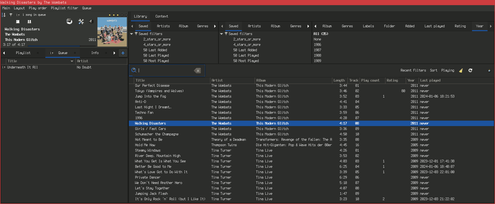
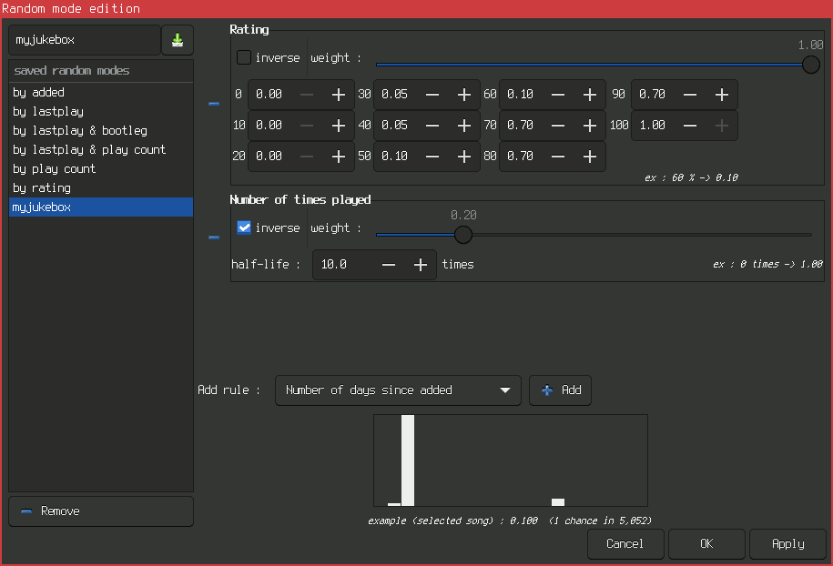

Background
==========

## Radio

For a long time in my life, I preferred to listen to music by turning on the
radio. Over the years, any given radio station would either always play only new
or only old songs. Some stations stopped sending news during the evening times
which are currently my primary times of listening. Additionally, none of the
existing radio stations seemed to fit the increasing variety of music taste.
After unsuccessfully trying to find a station that would satisfy my needs,
I started looking for alternatives to radio.

## No Streaming Service

The primary way to listen to music in 2023 seemed to be the use of
Music Streaming Services (e.g. Spotify). Streaming is similar to radio: Audio
quality is often mediocre (except for more expensive offerings like Tidal and
Qobuz). Additionally, with streaming (like with Radio) one doesn't “own” the
music in any way. Specifically, some much-liked music may disappear overnight
from the service if they decide to no longer license it (or are forced to remove
it for whatever reason).

Unlike public radio which can be received freely in Germany, most streaming
services cost a monthly fee or deliver an excessive number of ads in addition
to making mony from the user data by means of analytics. Ads are an issue with
(especially privately-owned) radio stations, too, but data protection issues
like tracking and analytics are of no concern to radio listeners. Effectively,
swichting to streaming would have meant to incur a monthly fee for licensing
the high-quality no-ads offering.

While this would have certainly been a valid means to upgrade from the “free”
radio listening experience, it would have also meant to spend a fixed amount
of money monthly and to add yet another dependency on the online connection
(I do not count the various “offline modes” of programs to be valid substitutes
for the real thing). Unlike with other subscriptions, there is nothing to “keep”
when cancelling such a service -- all data is typically in proprietary, DRM'ed
formats -- it is basically an infrastructure cost.

## Offline Music Collection

Due to these concerns, I was relucant to subscribe to a streaming service and
instead pursued the “old way” of building a music collection. The major
advantage of this approach is that building a collection allows stopping
payments (except for storage if you are pedantic) at any point in time without
losing any of the existing music. Over time, the costs are mostly due to the
addition of new music to the collection and could hence even decrease as the
collection builds-up. Better data protection and independence from online
sources and the existence of a particular service are additional benefits.

Getting started with a music collection in 2023 was much easier compared to
earlier times due to multiple favorable circumstances:

 * Individual songs can be bought online and I had already used this as a means
   to buy songs which were not played on the radio before (e.g. from Qobuz)
 * CDs still offer an acceptable audio quality and their handling is easier than
   ever before: Ripping CDs using `abcde -o flac` is a convenient means to
   copy CDs and add the necessary metadata in one step. I already owned the
   necessary CD drives due to the fact that I keep multiple “old” PCs around
   here. Finally, buying used CDs is quite cheap as in e.g. 3.00€/disc for a
   typical second-hand CD as sold on Medimops. Used CDs do not usually have
   any lower audio quality given the digital nature of music CDs. In my use,
   about 5 of 3000 songs had reading issues, this is less than 0.2%.

A lucky way to bootstrap a collection from almost zero (1 CD + a few FLACs from
Qobuz) was the opportunity to start from a stranger's music collection for free.
He told me that he no longer owned any playback equipment for CDs and that they
had been sitting in the basement for years. Sometimes, collections from similar
situations are also sold, but given their often strong emotional value to the
owners, they often do not exactly offer good value for the money.

## The Quest for Playback Software

Once the music collection started to take shape, (digital) organization and
playback of the collection became a real concern. Having owned only a few
music files before, my go-to playback applications were `mpv` and `mocp` none of
which seemed up to the task of playing back and managing a “real” music
collection with significantly more than 100 songs.

To my surprise and unlike with CD ripping, music collection management and
playback seem to not have advanced much beyond the times when music streaming
wasn't really a thing. To me, much of the software programs, features and
workflows looked like being stuck in the 2000s.

Specifically, I'd have expected the following things to have been resolved by
now but they apparently aren't:

 * A standard way to store playback counts and ratings portably such that they
   can be accessed from multiple software applications seems to not have
   emerged or been defined yet. This was really the most surprising thing about
   the music collection playback landscape in 2023: There is nothing comparable
   to the XMP format for pictures. Instead, there seem to be two flawed
   approaches to this:
    * The old-school way of each playback program doing its own, proprietary
      database format (luckily often text files or SQLite) that is not
      interoperable with other programs and also typically bound to the machine
      of operation e.g. by using absolute paths to the song files or something.
      I count `mpd` among this, too.
    * The storage of such data into the song files themselves.
      There seem to be strong opinions from two “camps” about this:
      In the one camp, people rightfully claim that the song files and
      personal metadata like rating (which can differ between people of course)
      should be kept separately. In the other camp, people claim that the
      storage of these metadata into the song files is a valid way to allow
      switching playback applications and devices while keeping the metadata.
      I agree with the the separation concerns and like to add that in my
      opinion, music file contents should basically never be changed after
      being recorded from the CD as to avoid accidentially re-encoding them
      which may incur a loss of quality. I also agree that this data should be
      kept closely to the files as to allow sharing this data between
      multiple devices and playback applications.
   There seems to be a proprietary extension to the M3U playlist format that
   puts rating information into the _playlist_. This does not really sound
   convincing, either, but seems to be the closest thing to an existing external
   metadata format for songs. See <https://forum.powerampapp.com/topic/19538-need-explanation-about-ratings-saved-in-m3u8-playlists/>.
   I was tempted to create an own playback application built on top of extending
   the M3U format for rating and play counts but decided against it in the end.
 * Bit-perfect playback (i.e. no additional re-sampling/conversion from the file
   to the DAC) is supported by many, but not all playback applications and often
   requires additional non-obvious settings to get to work. It came as a
   surprise to me that this was not the default out of the box for all
   applications already, but I guess one can live with having to fine-tune the
   settings.
 * Gapless playback seems to follow a similar fate: I would have expected this
   feature to be available everywhere but only selected applications implement
   it. Luckly, it does not matter much to my use case.
 * Playlist generation still is not really automated. In the old days I recall
   that playback software expected you to create the playlists that you wanted
   to play and then provided an in-order playback and a shuffle mode where
   shuffle would play all of the playlist entries exactly once but in random
   order. This still seems to be the only part that all applications support.
   Improvements beyond that are rare and insufficient for my use cases:
    * Many players support the usage of rules to select the songs in the
      playlist. If the user maintains accurate enough tags and ratings for their
      entire collection, these allow subsets to be selected programatically.
    * Some players integrate with external services (last.fm?) to allow
      for computing a _sensible next choice_ after a given song was played.
    * Very few players support advanced features like a random playback with the
      probability weightened by user-selected factors such as rating, number of
      times played, last playback etc.
 * Periodic news playback as is standard on the radio does not seem to be a
   feature provided by any of the common player applications. Some players
   offer _podcast_ support that could in theory be used to construct such a
   feature but even if podcasts are supported, it is expected that the user
   manually manages the interaction between music and podcast playback.

I checked the following playback applications to see whether they would suit
my unusual requirements (see points before):

Player/Homepage                                                  Version           Documentation                                                         Git(hub)                                                             Debian
-------------------------------------------                      ----------------  --------------------------------------------------------------------  -------------------------------------------------------------------  ----------------------------------------------------------------------------------------------------
[aqualung](https://aqualung.jeremyevans.net/)                    master/b9e3f5ccd  [manual](https://aqualung.jeremyevans.net/manual/aqualung-doc.html)   [jeremyevans/aqualung](https://github.com/jeremyevans/aqualung)      [removed for unmaintained](https://bugs.debian.org/cgi-bin/bugreport.cgi?bug=748560)
[gmusicbrowser](https://gmusicbrowser.org/)                      1.1.99.1          [guide](https://gmusicbrowser.org/guide.html)                         [squentin/gmusicbrowser](https://github.com/squentin/gmusicbrowser)  [removed for unmaintained](https://bugs.debian.org/cgi-bin/bugreport.cgi?bug=942001)
[quodlibet](https://quodlibet.readthedocs.io/en/quodlibet-4.6/)  4.5.0-2           [features](https://quodlibet.readthedocs.io/en/latest/features.html)  [quodlibet/quodlibet](https://github.com/quodlibet/quodlibet)        [quodlibet](https://packages.debian.org/bookworm/quodlibet)

Notes about these players:

 * aqualung -- This program was removed from Debian in 2014, but development was
   again active in 2023 (and years before) hence it still seems to be maintained
   upstream. Aqualung advertises support for bit-perfect and gapless playback
   even under difficult circumstances like mismatching bitrates. It claims to
   support podcasts but cannot download them over HTTPS making this feature
   difficult to use in practice today since most web servers require HTTPS and
   redirect/disallow HTTP-based access. IIRC it is missing some features like
   the weightened randomized playback or the tracking of play counts. The
   UI for the song that is currently being played is nicely detailed not only
   showing the song's name but also the technical information like the current
   bit rate. Aqualung can be extended in Lua and the documentation shows some
   examples that may reduce the barrier of entry compared to the other
   scriptable players.
 * gmusicbrowser -- This program is no longer be part of Debian and was removed
   back in 2019 due to a lack of maintainance. However, a GTK3 port is available
   as beta software and works quite nicely. See below for details.
 * quodlibet -- This Python+QT-program provides a lot of features and offers
   some podcast support (but no automatic news playback) in addition to standard
   music playback features. It can be controlled by plugins and IPC mechanisms.
   It can do a weigthened randomized playback but IIRC only on the album-level
   and not for individual songs. I personally thought that this program feels
   a little slow to operate. The associated metadata editor (exfalso) is
   excellent and well worth using also when not using quodlibet as the primary
   playback application.

Additionally, I took the following ones into consideration, but did not test
them so far. This list of links is mostly for my own notetaking :)

 * <https://www.audacious-media-player.org/>
 * <https://tauonmusicbox.rocks/>
 * [guayadeque](https://www.guayadeque.org/),
   <https://github.com/anonbeat/guayadeque>,
   <https://raw.githubusercontent.com/wiki/anonbeat/guayadeque/files/Guayadeque.Manual.pdf>
   -- this player looks promising due to its support to do a weightened
   randomized playback and podcast support. It is not in Debian and seems to be
   currently unmaintained, though.
 * <https://sayonara-player.com/> -- this one looks promising but is not my
   cup of tea due to its behaviour of writing rating information directly to
   the song files.
 * <https://github.com/strawberrymusicplayer/strawberry>
 * MPD ecosystem -- there is a whole slew of programs related to the
   _Music Player Daemon_. The general idea of MPD is to separate the playback
   and database as a server (MPD) from the GUI (client).
   See <https://mpd.readthedocs.io/en/stable/user.html> and for the clients:
   <https://www.musicpd.org/clients/>,
   <https://github.com/ncmpcpp/ncmpcpp>,
   <https://github.com/sp1ff/mpdpopm>
 * <https://owntone.github.io/owntone-server/smart-playlists/>
 * <https://github.com/clangen/musikcube>

## gmusicbrowser

After evaluating some of the playback applications, gmusicbrowser seems to
provide the closest match for my use cases: It supports all of the standard
features and (experimental) gapless playback, bit-perfect playback (when
configured with gstreamer backend, ALSA device `hw:...`, see
<https://www.head-fi.org/threads/bit-perfect-audio-from-linux.561961/#post_7596563>),
provides a highly customizable user interface and allows IPC using the
`gmusicbrowser` command and DBUS. It is one of the few applications that support
randomized playback weigthened by user-selected criteria.

The screenshot shows gmusicbrowser when controlled by gmusicradio. This
is not directly visible, but the queue is automatically populated by gmusicradio
and thus likely to contain a single song most of the times (as in the
screenshot).

This screenshot shows a configuration for the randomized playback that attempts
to prefer better-rated and lesser-played songs (criteria in decreasing order of
importance).

A randomized playback using this feature is better than an all-random playback
but still suffers many of the issues wrt. randomized playback: It is just not
“fair” and often rather plays the same song again rather than chosing another
one that is available. If playback count were to be rated stronger, this would
automatically cause the highly-rated songs to be played back less often.

Hence even with this advanced feature, the integrated playback mechanism still
seems to be insuficcient. Additionally, gmusicbrowser does not support news
playback out of the box and a hacky attempt to bolt-on that feature works only
partially (cf. `run_podget.sh`).

Abstract
========

This repository provides `gmusicradio.erl` -- a script that can be used to
control the playback of a running gmusicbrowser instance in a radio-inspired
way but for personal listening on a local Linux machine.

At the core, this consists of the following two key rules:

 * Songs that are more likely to be preferred by a majority of the audience
   appear every N songs (every M minutes). Since this is not a real radio
   station, the stars-rating from gmusicbrowser is taken as an indicator for
   the target audience's preference (you!).

 * News is played as it comes available and takes precedence over music playback
   but never cancels the running song. Currently, a podcast as retrieved by
   the external application `podget` is supported for this purpose.

Once started, gmusicradio runs in parallel to gmusicbrowser and automatically
enqueues new songs to play as the playback in gmusicbrowser continues. This
means that you can safely pause the playback for a short while and continue
later as the script just waits a little longer for the playback of the song
to complete. Also, you (acting as a DJ) can enqueue your own songs of choice
and the script ignores them such as long as afterwards, it recognizes the
playback of a song that it enqueued itself.

Metadata is entirely maintained by gmusicbrowser and gmusicradio reads the
`gmbrc` of gmusicbrowser to get to know the initial values of playback counters
and ratings. It then keeps an in-memory copy and locally tracks the playback
conunters under the assumption that its enqueued songs were the only actions to
affect this data. You can safely exit gmusicradio at any time to take full
control of the playback and re-start it later. In addition to the stars rating,
the algorithm uses the playback count as a secondary criterion and is thus not
going to create the same schedule again even if it were cancelled just after
having played a few songs.

Prerequisites
=============

To make use of this script, you need the following two logical prerequisites:

 * A working and running gmusicbrowser installation.
   If you are on Debian, you can safely use the .deb-file from the gmusicbrowser
   project page. As of this writing, it can be found here:
   <https://gmusicbrowser.org/download/gmusicbrowser_1.1.99.1_all.deb>.
 * A podcast to retrieve news from and a working configuration for
   podget such that it can retrieve it upon invoked as
   `podget -d CONFIG`.

As a software dependency, an Erlang OTP runtime is required (e.g. Debian
package `erlang`).

Setup the configuration of gmusicradio (see section _Configuration_) and then
run the script as `./gmusicradio.erl`. You can also build a Debian package
for it by running `ant package`.

_TODO PROVIDE THESE PACKAGE BUILD INSTRUCTIONS_

Configuration
=============

gmusicradio looks for a file called `.mdvl/gmusicradio.xml` in your home
directory. The following shows a file equivalent of the default settings:

~~~{.xml}
<?xml version="1.0" encoding="UTF-8"?>
<gmusicradio
	podcast_conf="/data/programs/music2/supplementary/news/conf"
	podcast_dir="/data/programs/music2/supplementary/news/pod"
	podcast_timeout="30000"
	podcast_chck="10"
	gmbrc="/home/linux-fan/.config/gmusicbrowser/gmbrc"
	await_ms="60000"
	cmd_timeout="10000"
	schedule_len="60"
	chaos_factor="2.0"
	min_good_perc="30"
	default_rating="60"
/>
~~~

If any of the attributes is left out, its default value is used. For the
`gmbrc`, the default is not actually `/home/linux-fan` but rather the user's
home directory hence the minimum options that need to be adjusted to your
installation are `podcast_conf` and `podcast_dir`, all other values can
(but need not be) changed.

## Podcast Configuration

`podcast_conf`
:   This points to the directory containing `podgetrc` and `serverlist`.
    These files are processed by running `podget` -- gmusicradio does not
    currently process them directly. See below for example values for these
    files.
`podcast_dir`
:   This points to the directory that is usually given as `DIR_LIBRARY` in the
    `podgetrc`. gmusicradio scans this directory for new .mp3 files to identify
    that a new podcast _episode_ was downloaded and then enqueues it for
    playback. Note that in theory this path could be found automaically by
    gmusicradio (it is encoded in the `podgetrc`), but this is just not
    implemented for now and hence users need to specify this path.
`podcast_timeout`
:   Configures the timeout in milliseconds that an invocation of `podget` is
    expected to take (at most). The default should be OK unless your Internet
    connection, the podcast server or your local machine are slow. In such cases
    it may make sense to increase this timeout.
`podcast_chck`
:   Configures the interval at which `podget` should be called. It is given as
    a multiple of `await_ms` i.e. the default of 10 with `await_ms` of 60000
    means every 600000ms = every 10 minutes. This should be OK for many cases,
    but if your news are only every two hours you could also increase this to
    e.g. 60 to check for news about once every hour.

### Example `podgetrc`

~~~
CONFIG_SERVERLIST=serverlist
DIR_LIBRARY=/data/programs/music2/supplementary/news/pod
LOG_FAIL=errors
LOG_COMPLETE=done
WGET_BASEOPTS="-c -nH"
MOST_RECENT=1
FORCE=0
CLEANUP=1
CLEANUP_DAYS=1
MIN_SPACE=614400
NO_PLAYLIST=0
PLAYLIST_NAMEBASE=New-
DATE_FORMAT=+%F
ASX_PLAYLIST=0
FILENAME_BADCHARS="\`~!#$^&=+{}*[]:;\"'<>?|\\"
FILENAME_REPLACECHAR=_
FILENAME_FORMATFIX=1
FILENAME_FORMATFIX2=1
FILENAME_FORMATFIX3=0
FILENAME_FORMATFIX4=0
FILENAME_FORMATFIX5=1
FILENAME_FORMATFIX6=1
FILENAME_FORMATFIX7=1
FILENAME_FORMATFIX8=1
FILENAME_FORMATFIX9=1
FILENAME_FORMATFIX10=1
~~~

### Example `serverlist`

~~~
https://www.deutschlandfunk.de/nachrichten-108.xml deutschlandfunk
~~~

## Other Configuration

Typically, the `default_rating` and `min_good_perc` values could be of interest
for user adjustments.

`gmbrc`
:   Configurs the path to the gmusicbrowser config file. gmusicradio parses the
    `[Songs]` section of that file to find your music, ratings and initial
    play counts (per startup). By default, gmusicbrowser computes the path from
    the user home directory hence the default may be OK for many cases already.
`await_ms`
:   Configures the interval in milliseconds to query gmusicbrowser for its
    currently playing song. This should be significantly shorter than the
    shortest song in your library because it must have a chance to reliably
    “see” each song as it is being played-back because that is the trigger
    for gmusicradio to enqueue the next song of the schedule. The default should
    be OK for Pop and Rock songs but may need some adjustments for other genres.
`cmd_timeout`
:   Timeout in ms for a call to `gmusicbrowser` to return. When no instance
    is running, a `gmusicbrowser` may automatically be launched by gmusicradio
    and this will cause the process to not exit (quickly). If this timeout
    is observed, it is thus not an error from the point of gmusicradio and
    rather indicates that it just started the `gmusicbrowser` instance. Thus
    it is recommended to set this to a value such that it is highly unlikely
    for a regular enqueue action to take so long (usually it takes less than
    1 sec on my machine) but the value should be short enough such that the
    follow-up action can quickly take place if the gmusicbrowser window was
    lanuched by the enqueue action. The default of 10sec should be OK for many
    cases, but you can of course experiment with shorter intervals like e.g.
    5000 for 5sec.
`schedule_len`
:   Configures the length of a schedule (aka. playlist) to generate by
    gmusicradio. The value must be lower than the total number of songs in the
    database. In principle, the schedule has no upper limit if your music
    library is large enough, but there is also little advantage to make this
    needlessly large because gmusicradio automatically generates a new schedule
    once it has finished playing the current one. The default should thus be OK
    except for the following cases: If you have only a few songs, you may need
    to reduce this value. If you want to play all day without repeating
    any songs with three-stars or less, you can increase this value accordingly.
`chaos_factor`
:   The chaos factor affects the randomness in the playlist generation. It
    ranges from 0.0 upwards. A value < 1.0 ensures that the schedule always
    prefers the songs with lower play count. A value of 0.0 disables randomness
    in the playlist order (and instead follows the index values defined by
    gmusicbrowser). Values > 1 allow (with certain probability) for songs to
    be played even if they are not due for this yet per their play counts. This
    may increase the perceived randomness of the playlist. In many cases, the
    default of 2.0 should be OK.
`min_good_perc`
:   When the music collection contains many songs with rating of 3 stars or less
    which is e.g. expected when it is sourced from many albums that often
    contain only a few “favorite” tracks and a lot of “ok-ish” songs then there
    is a shortage of songs with four or more stars. This is quite normal and the
    standard radio approach to fix this is to play these “favorite” songs more
    often compared to the other ones. The `min_good_perc` ranges from 1 to 90
    and is used to configure this repeated playback behaviour: It defines a
    guideline percentage of 4+-stars songs to play and defaults to 30%. If too
    few well-rated songs exist, the script repeats the “good songs” playlists
    until it risks surpassing this percentage. IOW: The actual playback of good
    songs is usually going to be less than the given percentage, but it is as
    close to it as possible without “unfairly” repeating one song more often
    than another. In practice, this fairness effect can only be noted with large
    schedule lengths. The practical effect of this value is that higher values
    cause more of your favorite songs to be played at the expense of giving a
    “less interesting” overall programme as it is going to repeat this limited
    “best” songs more often. On the other hand, setting this to a low value
    eventually causes the good songs to not be repeated any more than all other
    songs and results in a very fair distribution. The default of 30% sounds
    good to my ears with the collection natively providing 7.5% of 4+-stars
    songs (see example output further down).
`default_rating`
:   This setting defines the rating for “unrated” songs. It is expected that you
    set it to the same value as in gmusicbrowser (in my case that is 3 stars
    corresponding value 60) but you can of course also deviate to achieve
    different playback between gmusicbrowser and gmusicradio. The value could
    in theory be automatically retrieved from the `gmbrc` but this is currenlty
    not implemented.

Example Output
==============

The following shows a truncated output of running gmusicradio.
Some of the details about the output format are explained in this section.

~~~
$ gmusicradio.erl
Ma_Sys.ma gmusicradio 1.0.0 (c) 2024 Ma_Sys.ma <info@masysma.net>
Read GMBRC... OK
Distribution of stars
 1 Star     91 (ignore)
 2 Stars   104 ( 2.89%)
 3 Stars  3228 (89.59%)
 4 Stars   271 ( 7.52%)
 5 Stars     0 ( 0.00%)
Duplicate = 3
Schedule of 60 songs:
I  279 R80 C    0 Linkin Par Meteora              Easier to Run        (2003)
I 2681 R60 C    0 Rihanna    Unapologetic         Jump                 (2012)
I  617 R40 C    0 Sheryl Cro Tomorrow Never Dies  No One Said It Would (1997)
I 2740 R60 C    0 Razorlight Slipway Fires        Monster Boots        (2008)
[...]
I 2265 R60 C    0 Mary J. Bl No More Drama        Love                 (2001)
I 2076 R80 C    1 Coolio     Gangsta’s Paradise   Gangsta’s Paradise   (1995)
I 3498 R60 C    0 Sugababes  Angels With Dirty Fa Angels With Dirty Fa (2003)
I 1358 R60 C    0 The Police Their Greatest Hits  Every Little Thing S (1990)
ENQUEUE Linkin Par Meteora              Easier to Run        (2003)
AWAIT   Linkin Par Meteora              Easier to Run        (2003)
AWAIT   Linkin Par Meteora              Easier to Run        (2003)
AWAIT   Linkin Par Meteora              Easier to Run        (2003)
AWAIT   Linkin Par Meteora              Easier to Run        (2003)
AWAIT   Linkin Par Meteora              Easier to Run        (2003)
FOUND   Linkin Par Meteora              Easier to Run        (2003)
ENQUEUE Rihanna    Unapologetic         Jump                 (2012)
AWAIT   Rihanna    Unapologetic         Jump                 (2012)
AWAIT   Rihanna    Unapologetic         Jump                 (2012)
AWAIT   Rihanna    Unapologetic         Jump                 (2012)
AWAIT   Rihanna    Unapologetic         Jump                 (2012)
AWAIT   Rihanna    Unapologetic         Jump                 (2012)
FOUND   Rihanna    Unapologetic         Jump                 (2012)
ENQUEUE Sheryl Cro Tomorrow Never Dies  No One Said It Would (1997)
AWAIT   Sheryl Cro Tomorrow Never Dies  No One Said It Would (1997)
AWAIT   Sheryl Cro Tomorrow Never Dies  No One Said It Would (1997)
AWAIT   Sheryl Cro Tomorrow Never Dies  No One Said It Would (1997)
AWAIT   Sheryl Cro Tomorrow Never Dies  No One Said It Would (1997)
[...]
~~~

## Distribution of Stars

gmusicradio parses the `gmbrc` and prints what it recognized from that config
in the form af a _Distribution of stars_. This is a nice statistic and allows
you to quickly identify if it picked the wrong config file, if the default
rating is set wrongly or other errors of that kind. The numbers may also be
useful for adjusting the Configuration settings.

Note that 1-star rated songs (and 0-star if you use that distinction) are
ignored by gmusicradio. The idea is that there may be songs that you don't want
to hear (or not hear in the automatic playlist) but still want to keep on disk
for reaons.

Based on this distrubtion and on `min_good_perc` gmusicradio computes a number
of times to repeat the 4+-rated songs. The resulting repeat factor is printed
out as “Duplicate” number. In the example, the computation is as follows:

 * 104 + 3228 = 3332 songs are rated 3-
 * 271 songs are rated 4+
 * min_good_perc is 30%
 * 271 / 3332 is 8.1%, to come closer to 30% repeat this three times for
   3 * 271 / 3332 = 24%
 * The effective frequency of 4+-rated songs in the result playlist is supposed
   to be about 24%

## Schedule

Each line in the schedule is formatted as follows:

 * `I Number` -- Displays the index associated to the track by gmusicbrowser.
   This is mostly useful for debugging purposes.
 * `R Number` -- Displays the rating (as retrieved from gmbrc) of the song.
   This allows you to check the distribution of differently-rated songs in
   the output playlist.
 * `C Number` -- Displays the playback count.
 * After this number, the song metadata is printed as
   `artist album track name (year)` shortened to a limited number of characters
   to fit the classic 80 terminal width.

## Playback

The actions by the script are shown by all-caps states:

 * `ENQUEUE` -- Means the given song was enqueued to gmusicbrowser
 * `AWAIT` -- The script waits checked if that song was just playing as a hint
   for it to enqueue the next.
 * `FOUND` -- Like AWAIT but the song was detected to be playing.
 * `PODCAST` -- Not shown in the example output, but a `PODCAST` is like an
   `ENQUEUE` line except for a file retrieved via podcast. There is nothing like
   `AWAIT`/`FOUND` for podcast episodes.

This repeats until the schedule is complete after which a new schedule is
printed.

Other Repository Contents
=========================

File `run_podget.sh` contains a script that was used prior to gmusicradio to
attach podcast playback to gmusicbrowser. It requires that the gmusicbrowser
is already running and expects the podcast configuration and library directories
to be placed next to the script in a specific way (see its source code).

It works OK in conjunction with the randomized playback but fails if e.g.
playback in sequence is wanted because then gmusicbrowser always jumps to a
specific position after the news playback.

The script can serve as an additional inspiration for users intending to perform
their own gmusicbrowser automation.

Future Directions
=================

There is still much to be learned regarding the properties of a multi-machine
setup, playback on networked audio targets, audio volume normalization issues,
optimizations in the playback based on the “contents” of the preceding song
and better integration of news sources (note how the news are always delayed
in the current setup). Also, it may be interesting to explore other player
software (although data migration is immediately a concern).

None of these things is easy to address, hence I expect this script to remain
as-is for the beginning.

See Also
========

## Relevant Programs

 * [gmusicbrowser(1)](https://manpages.debian.org/testing/gmusicbrowser/gmusicbrowser.1.en.html)
 * [podget(7)](https://manpages.debian.org/bookworm/podget/podget.7.en.html)
 * [abcde(1)](https://manpages.debian.org/bookworm/abcde/abcde.1.en.html)

## Webradio

~~~
mpv https://radiogroup-stream32.radiohost.de/radio-frankfurt_mp3-192
mpv http://streams.radiobob.de/bob-wacken/mp3-192/streams.radiobob.de/
mpv --cache=yes --cache-secs=4 --demuxer-max-bytes=$((1024 * 1024 * 10)) http://motherearth.streamserver24.com:18910/motherearth.klassik
~~~
